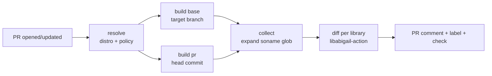

# ros2-abi-action

[](https://github.com/fujitatomoya/ros2-abi-action/actions/workflows/ci.yml)
[](LICENSE)

ROS-aware ABI compliance checking for C/C++ shared libraries on every pull
request. `ros2-abi-action` builds a ROS 2 package **twice** — once against the
PR's target branch and once against the PR head — in the matching distro
container, then delegates the binary ABI diff to
[`fujitatomoya/libabigail-action`](https://github.com/fujitatomoya/libabigail-action)
(which wraps [libabigail](https://sourceware.org/libabigail/)'s `abidiff`).

It applies [REP-0009](https://ros.org/reps/rep-0009.html) policy automatically
from the PR's target branch: **released distros must not break ABI**, while
**rolling is advisory only**. Results surface as a sticky PR comment, labels,
and a pass/fail check, so maintainers can decide on backports at a glance.

This is **Action 2** of a two-action design:

| Action | Repository | Role |
| --- | --- | --- |
| 1 | [`libabigail-action`](https://github.com/fujitatomoya/libabigail-action) | Generic, repo-agnostic. Diffs two pre-built `.so` files. |
| 2 | **`ros2-abi-action`** (this repo) | ROS-aware orchestration: detect distro, build in container, delegate to Action 1. |

The split keeps the libabigail wrapper useful to any C/C++ project, while the
ROS layer encodes policy in one place that all core repos can share.

---

## Quick start

Add a small workflow to your ROS 2 package repository:

```yaml
# .github/workflows/abi.yml
name: ABI Check
on:
  pull_request:
    branches: [rolling, lyrical, kilted, jazzy, humble]

jobs:
  abi:
    permissions:
      contents: read
      pull-requests: write
      issues: write
    uses: fujitatomoya/ros2-abi-action/.github/workflows/check.yml@v1
    with:
      package: rclcpp
      soname: librclcpp.so
      suppressions: .abignore   # optional
```

That is the entire integration burden per repo. The distro is derived from the
PR's target branch; policy follows REP-0009.

---

## How it works



1. **resolve** — derive the distro from `GITHUB_BASE_REF` (or the explicit
   `distro` input) and look up the container image; resolve the policy.
2. **build** (matrix `base` + `pr`) — inside the distro container: check out the
   correct ref, optionally `vcs import` a `.repos` file, `rosdep install`, then
   `colcon build --packages-up-to <package>` with `-DCMAKE_BUILD_TYPE=Debug`
   and `-g -Og` so DWARF is present. The matched library/libraries are uploaded
   as the `lib-base` / `lib-pr` artifacts. `install/` builds are sped up with
   `ccache` keyed on `(distro, package.xml, .repos, side)`.
3. **collect** — expand the `soname` glob into a concrete list of libraries.
4. **diff** (matrix, one job per library) — download both artifacts, merge the
   default ROS suppression spec with the repo's `.abignore`, and invoke
   `libabigail-action` with `fail-on` set from the resolved policy.

---

## Inputs (reusable workflow `check.yml`)

| Input | Required | Default | Description |
| --- | --- | --- | --- |
| `package` | yes | — | Colcon package name to build (e.g. `rclcpp`). |
| `soname` | yes | — | Library file or glob (e.g. `librclcpp.so` or `lib*.so`). |
| `distro` | no | `auto` | `auto` (derive from PR target branch) or explicit: `humble`, `jazzy`, `kilted`, `lyrical`, `rolling`, … |
| `suppressions` | no | — | Path to a suppression file relative to the repo root. |
| `policy` | no | `auto` | `auto` \| `strict` (fail on break) \| `advisory` (warn only). |
| `upstream-workspace` | no | — | Path to a `.repos` file for additional source deps. |
| `comment-pr` | no | `true` | Post / update the sticky PR comment. |
| `label-compat` | no | `ABI compatible` | Label applied when compatible / additions-only. |
| `label-break` | no | `ABI break` | Label applied when incompatible. |
| `image-prefix` | no | `docker.io/tomoyafujita/ros2dev` | Container image repository prefix (`<prefix>:<distro>`). |

---

## Distro → container map

The container image is `<image-prefix>:<distro>`. The default prefix points at
the full ROS 2 development images published from
[`ros2_devenv_builder`](https://github.com/fujitatomoya/ros2_devenv_builder),
which already have every `rosdep` dependency installed so a single package can
be built from source quickly.

| Distro | Default image |
| --- | --- |
| `humble` | `docker.io/tomoyafujita/ros2dev:humble` |
| `jazzy` | `docker.io/tomoyafujita/ros2dev:jazzy` |
| `kilted` | `docker.io/tomoyafujita/ros2dev:kilted` |
| `lyrical` | `docker.io/tomoyafujita/ros2dev:lyrical` |
| `rolling` | `docker.io/tomoyafujita/ros2dev:rolling` |

`abidiff` itself is **not** required in the build image — the diff runs on the
host runner, where `libabigail-action` installs it. The optional, slimmer
`abidiff`-ready images in [`containers/`](containers/) are built weekly by
[`build-images.yml`](.github/workflows/build-images.yml) and published to
`ghcr.io/<owner>/ros-abi:<distro>`; point `image-prefix` at them to opt in.

---

## Policy resolution (REP-0009)

When `policy: auto`:

| Distro | Resolved policy | `fail-on` | Effect |
| --- | --- | --- | --- |
| `rolling` | `advisory` | `none` | Never fails; label + comment are advisory. |
| released (`humble`, `jazzy`, `kilted`, `lyrical`, …) | `strict` | `incompatible` | Fails the check on an incompatible change. |

### Verdict → action mapping

| `abidiff` result | Released distro (strict) | Rolling (advisory) |
| --- | --- | --- |
| Compatible | ✅ pass · `ABI compatible` | ✅ pass · `ABI compatible` |
| Additions only | ✅ pass · `ABI compatible` | ✅ pass · `ABI compatible` |
| Incompatible | ❌ fail · `ABI break` | ⚠️ pass · `ABI break` |

The distinction between *additions-only* and *incompatible* is what matters for
backports: additions are safe to backport to a released, ABI-stable branch;
breaking changes are not.

---

## Suppressions (`.abignore`)

`abidiff` accepts suppression specs that filter known-benign or intentional ABI
deltas. The convention is a per-repo `.abignore` at the repository root.

This action ships an opinionated **default ROS suppression spec**
([`suppressions/ros-default.abignore`](suppressions/ros-default.abignore))
covering common noise (`std::` template instantiation churn,
`detail`/`impl`/`internal` symbols). It is **merged** with the repo's file when
both exist. The format follows libabigail's suppression spec
(`man libabigail-suppr-spec`).

---

## Multi-library repos

`soname` accepts a glob (e.g. `lib*.so`). The action expands it and runs the
diff **once per matched library**, each with its own sticky-comment marker so
they coexist on a single PR. Per-library verdicts are combined: under strict
policy, if **any** library is incompatible, the workflow fails.

---

## Composite action (advanced)

[`action.yml`](action.yml) is a lower-level composite action for users who have
already built both library versions and want to run the ROS-aware diff inside
their own job. It resolves policy, merges suppressions, and delegates to
`libabigail-action` for a **single** library:

```yaml
- uses: fujitatomoya/ros2-abi-action@v1
  with:
    package: rclcpp
    library: librclcpp.so
    base-lib: base/install/rclcpp/lib/librclcpp.so
    head-lib: pr/install/rclcpp/lib/librclcpp.so
    distro: jazzy
    policy: auto
    suppressions: .abignore
```

The reusable workflow `check.yml` is the recommended entry point for most repos;
it handles building both versions and multi-library glob expansion for you.

---

## Required permissions

For the sticky comment and labels, the calling workflow must grant:

```yaml
permissions:
  contents: read
  pull-requests: write
  issues: write
```

If you only want the pass/fail check, set `comment-pr: false` and leave the
labels at their defaults; then `contents: read` alone is enough.

---

## Versioning

Both actions follow semver. Pin to the major tag for automatic patch/minor
updates:

```yaml
uses: fujitatomoya/ros2-abi-action/.github/workflows/check.yml@v1
```

The libabigail version is pinned via the container image; bumping it is a minor
release.

---

## Known limitations

- **Templates and inline functions in headers are invisible.** They don't appear
  in the `.so`, so header-level API breaks still need human review.
- **ELF/DWARF only** — Linux shared libraries. No MSVC, no macOS dylibs.
- **Requires debug info** (`-g`). Stripped binaries give a much weaker check; the
  action builds with `-g -Og` to avoid this.
- **Symbol visibility matters** — only exported symbols are checked. Projects
  without `-fvisibility=hidden` + explicit exports may see noisy reports.
- **Plugin / nodelet-style libraries** without a stable public ABI surface should
  be excluded via `.abignore` or omitted from `soname`.

---

## Repository layout

```
ros2-abi-action/
├── action.yml                 # composite action (single-library diff)
├── README.md
├── LICENSE
├── .github/workflows/
│   ├── check.yml              # reusable workflow consumers call
│   ├── build-images.yml       # weekly container builds (GHCR)
│   └── ci.yml                 # self-test
├── containers/
│   ├── humble.Dockerfile
│   ├── jazzy.Dockerfile
│   ├── kilted.Dockerfile
│   ├── lyrical.Dockerfile
│   └── rolling.Dockerfile
├── scripts/
│   ├── resolve-distro.sh
│   ├── resolve-policy.sh
│   ├── colcon-build.sh
│   ├── locate-library.sh
│   └── merge-suppressions.sh
├── suppressions/
│   └── ros-default.abignore   # opinionated ROS default, merged with .abignore
└── test/
    └── fixtures/
        └── toy-ros-pkg/       # minimal pkg with a macro-toggled ABI break
```

---

## Non-goals

- Source-level API compatibility — libabigail is binary ABI only.
- Inline / templated code that doesn't appear in the `.so`.
- MSVC / macOS — libabigail is ELF/DWARF only.
- Replacing `industrial_ci` or `osrf/auto-abi-checker` — those remain useful for
  ABICC-based workflows.

## License

[Apache-2.0](LICENSE).