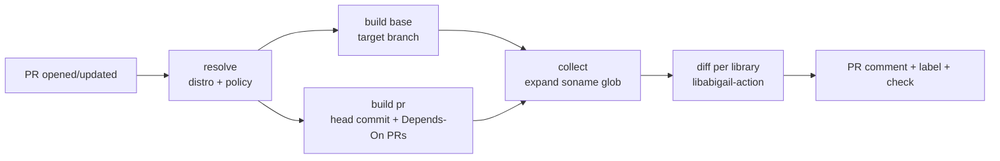

# ros2-abi-action

[](https://github.com/fujitatomoya/ros2-abi-action/actions/workflows/ci.yml)
[](LICENSE)

ROS-aware ABI compliance checking for C/C++ shared libraries on every pull
request. `ros2-abi-action` builds one or more ROS 2 packages **twice** — once against the
PR's target branch and once against the PR head — in the matching distro
container, then delegates the binary ABI diff to
[`fujitatomoya/libabigail-action`](https://github.com/fujitatomoya/libabigail-action)
(which wraps [libabigail](https://sourceware.org/libabigail/)'s `abidiff`).

It applies [REP-0009](https://ros.org/reps/rep-0009.html) policy automatically
from the PR's target branch: **released distros must not break ABI**, while
**rolling is advisory only**. Results surface as a sticky PR comment, labels,
and a pass/fail check, so maintainers can decide on backports at a glance.

This is **Action 2** of a two-action design:

| Action | Repository | Role |
| --- | --- | --- |
| 1 | [`libabigail-action`](https://github.com/fujitatomoya/libabigail-action) | Generic, repo-agnostic. Diffs two pre-built `.so` files. |
| 2 | **`ros2-abi-action`** (this repo) | ROS-aware orchestration: detect distro, build in container, delegate to Action 1. |

The split keeps the libabigail wrapper useful to any C/C++ project, while the
ROS layer encodes policy in one place that all core repos can share.

---

## Quick start

Add a small workflow to your ROS 2 package repository:

```yaml
# .github/workflows/abi.yml
name: ABI Check
on:
  pull_request:
    branches: [rolling, lyrical, kilted, jazzy, humble]

jobs:
  abi:
    permissions:
      contents: read
      pull-requests: write
      issues: write
    uses: fujitatomoya/ros2-abi-action/.github/workflows/check.yml@v1
    with:
      package: rclcpp
      soname: librclcpp.so
      suppressions: .abignore   # optional
```

That is the entire integration burden per repo. The distro is derived from the
PR's target branch; policy follows REP-0009.

For a repository that contains several packages, list them all in `package`
(space-separated) and use a `soname` glob. Everything is built once per side
and each matched library is diffed in its own job.

**ROS 2 core repositories** (`rclcpp`, `rcl`, `rmw`, …) must additionally set
`build-mode: source`, because their dependencies' source branches are usually
ahead of the released binaries (see [Build modes](#build-modes-binary-vs-source)):

```yaml
    with:
      package: rclcpp rclcpp_action rclcpp_components rclcpp_lifecycle
      soname: 'lib*.so'
      build-mode: source
```

---

## How it works


```mermaid
flowchart LR
    A[PR opened/updated] --> R[resolve<br/>distro + policy]
    R --> B1[build base<br/>target branch]
    R --> B2[build pr<br/>head commit + Depends-On PRs]
    B1 --> C[collect<br/>expand soname glob]
    B2 --> C
    C --> D[diff per library<br/>libabigail-action]
    D --> E[PR comment + label + check]
```

1. **resolve** — derive the distro from `GITHUB_BASE_REF` (or the explicit
   `distro` input) and look up the container image for the requested
   `build-mode` / `source-strategy`; resolve the policy; parse `Depends-On:`
   lines from the PR description.
2. **build** (matrix `base` + `pr`) — inside the distro container: check out the
   correct ref, optionally `vcs import` a `.repos` file, in source mode import
   `ros2.repos` and detect which repositories moved since the image was built,
   on the PR side check out the related PRs, `rosdep install`
   for the packages in the build closure, then
   `colcon build --packages-up-to <package...>` with `-DCMAKE_BUILD_TYPE=Debug`
   and `-g -Og` so DWARF is present. When `package` lists several names, colcon
   builds the union of their dependency closures in one invocation, so shared
   dependencies are compiled once. The matched library/libraries are uploaded
   as the `lib-base` / `lib-pr` artifacts. `install/` builds are sped up with
   `ccache` keyed on `(distro, build-mode, package.xml, .repos, side)`.
3. **collect** — expand the `soname` glob into a concrete list of libraries.
4. **diff** (matrix, one job per library) — download both artifacts, merge the
   default ROS suppression spec with the repo's `.abignore`, and invoke
   `libabigail-action` with `fail-on` set from the resolved policy.

---

## Inputs (reusable workflow `check.yml`)

| Input | Required | Default | Description |
| --- | --- | --- | --- |
| `package` | yes | — | Colcon package name(s) to build. Space-separated for multi-package repos (e.g. `rclcpp rclcpp_action rclcpp_lifecycle`); built together via one `--packages-up-to`. |
| `soname` | yes | — | Library file or glob (e.g. `librclcpp.so` or `lib*.so`). |
| `distro` | no | `auto` | `auto` (derive from PR target branch) or explicit: `humble`, `jazzy`, `kilted`, `lyrical`, `rolling`, … |
| `build-mode` | no | `binary` | `binary`: build against released `ros-<distro>-*` packages (downstream repos). `source`: import the distro's `ros2.repos` and build against today's source tree (ROS 2 core repos). |
| `source-strategy` | no | `incremental` | Source mode only. `incremental`: nightly source underlay, recompile only what moved. `scratch`: compile the whole closure from source, no cache. |
| `related-prs` | no | — | Extra related PRs (`owner/repo#N` or URLs) applied on the PR side, merged with the `Depends-On:` lines of the PR description. |
| `suppressions` | no | — | Path to a suppression file relative to the repo root. |
| `policy` | no | `auto` | `auto` \| `strict` (fail on break) \| `advisory` (warn only). |
| `upstream-workspace` | no | — | Path to a `.repos` file for additional source deps. |
| `comment-pr` | no | `true` | Post / update the sticky PR comment. |
| `label-compat` | no | `ABI compatible` | Label applied when compatible / additions-only. |
| `label-break` | no | `ABI break` | Label applied when incompatible. |
| `image-prefix` | no | `ghcr.io/fujitatomoya/ros-abi` | Container image repository prefix (`<prefix>:<distro>`). |

---

## Build modes: binary vs source

The package under test always comes from the PR, but its *dependencies* can
come from two places:

| `build-mode` | Dependencies come from | Use for |
| --- | --- | --- |
| `binary` (default) | Released `ros-<distro>-*` Debian packages in `/opt/ros/<distro>` | Downstream packages that build against a released distro (e.g. [`rcl_logging_journal`](https://github.com/fujitatomoya/rcl_logging_journal)). |
| `source` | A source-built overlay of the ROS 2 core, plus any upstream repository that moved since the image was built | ROS 2 core repositories (`rclcpp`, `rcl`, `rmw`, `rosbag2`, …). |

Core repositories cannot use `binary`: their source branches depend on API in
sibling repositories that has not been released to the binary archive yet
(rolling syncs are irregular, released distros only get periodic patch
releases), so the PR fails to compile against `/opt/ros/<distro>`. The
`ros2/rclcpp` rolling branch, for instance, needs `rcl_action` graph API that
`ros-rolling-rcl-action` does not ship yet.

In `source` mode every PR run imports the distro's
[`ros2.repos`](https://github.com/ros2/ros2) (minus the repository under test,
which is checked out from the PR) into the colcon workspace, so the PR is
always compiled against **today's** source branches. Two strategies control
how much of that tree is actually recompiled:

| `source-strategy` | What gets compiled per side |
| --- | --- |
| `incremental` (default) | The PR's packages, every upstream package whose repository moved since the nightly image was built, everything that depends on those inside the target closure, and any upstream package the image does not provide. The rest comes prebuilt from the image. DDS vendors are always taken from the image. |
| `scratch` | The whole dependency closure of the target packages, from source, ignoring the image's prebuilt workspace. Slower and uncached, but with no prebuilt state at all. |

Both strategies run in the same `ros-abi:<distro>-source` image and produce
the same binaries for the packages under test; the incremental one only skips
recompiling sources that are byte-identical to what the image already built.

The **nightly image** `ros-abi:<distro>-source` is built by
[`containers/source.Dockerfile`](containers/source.Dockerfile), which follows
the official [Ubuntu (source)](https://docs.ros.org/en/rolling/Installation/Alternatives/Ubuntu-Development-Setup.html)
instructions step by step; the values that differ between distros (Tier 1
Ubuntu release, development tool set, `rosdep --skip-keys`) come from
[`containers/distro-args.sh`](containers/distro-args.sh). The build runs with
**no binary ROS 2 installation present**, as those instructions require:
locale, Universe and `ros2-apt-source`, the documented development tool set,
`ros2.repos` import, `rosdep install` with the documented `--skip-keys`, and
`colcon build` of the **entire manifest**, so every repository under
`ros2/ros2.repos` is available as a source underlay. The build uses
`Debug -g -Og` instead of the documented release mixin (abidiff needs DWARF;
the flags are shared with the PR-time build through
[`scripts/abi-build-flags.sh`](scripts/abi-build-flags.sh)), turns tests off,
and continues past a broken package (listed in `/opt/ros2_ws/missing.txt`;
such a package is simply rebuilt at PR time). The exact commit of every
imported repository is recorded in `/opt/ros2_ws/snapshot.repos`.

At PR time [`scripts/sync-upstream.py`](scripts/sync-upstream.py) resolves the
current head of every manifest repository with `git ls-remote` (in parallel),
diffs it against the snapshot, imports the manifest, and hands the moved
repositories to [`colcon-build.sh`](scripts/colcon-build.sh), which builds with
`--packages-up-to <targets> --packages-above <moved + targets>`. Colcon
intersects the two selections, so an rcutils change rebuilds rcl and rclcpp
too, while unrelated repositories stay untouched.

Repositories that are not part of `ros2.repos`, or that need extra source
dependencies, can still add them with `upstream-workspace` in either mode.

---

## Related pull requests (`Depends-On:`)

Changes across ROS 2 repositories often land in pairs: an `rcl` PR adds an
API and an `rclcpp` PR consumes it. Until the `rcl` PR merges, the `rclcpp` PR
cannot compile against the `rcl` branch. Declare the dependency in the PR
description, on its own line:

```
Depends-On: ros2/rcl#1234
Requires: https://github.com/ros2/rmw/pull/567, ros2/rcutils#89
```

Recognised keywords are `Depends-On`, `Depends on`, `Depends`, `Requires`,
`Needs`, `Blocked by` and `Companion` (case-insensitive, optionally after a
list marker). References may be `owner/repo#N` or full PR URLs; several may
share a line. Only keyword-labelled lines are considered, so `Closes …`,
`Similar to …` and other links elsewhere in the body are ignored, and HTML
comments from PR templates are stripped first.

The referenced PRs are checked out at their merge ref (`refs/pull/N/merge`,
falling back to `refs/pull/N/head` if the PR conflicts with its base) and
applied to the **PR side only**. The base side stays the pre-PR world, so the
resulting diff shows exactly the ABI effect of landing both changes. A repo
that is in `ros2.repos` is switched to the PR ref in place; one that is not is
cloned into the workspace, which also makes this work in `binary` mode for
downstream packages. The `related-prs` input adds references from the calling
workflow (useful for `workflow_dispatch`) on top of the parsed ones.

Once the dependency PR merges, the line becomes a no-op: the sync step picks
the merged commit up from the branch like any other upstream change.

---

## Distro → container map

The container image is `<image-prefix>:<distro>` in binary mode and
`<image-prefix>:<distro>-source` in source mode. The default prefix points at
the `ros-abi` images built nightly from [`containers/`](containers/) by
[`build-images.yml`](.github/workflows/build-images.yml). The binary images are
the official `ros:<distro>` base (binary underlay at `/opt/ros`, colcon,
rosdep) plus `ccache` and `abigail-tools`; the source images are plain Ubuntu
with the whole of `ros2.repos` built from source as described above, and no
`/opt/ros`. Missing package dependencies are installed by `rosdep` at build
time.

| Distro | `binary` image | `source` image |
| --- | --- | --- |
| `humble` | `ghcr.io/fujitatomoya/ros-abi:humble` | `ghcr.io/fujitatomoya/ros-abi:humble-source` |
| `jazzy` | `ghcr.io/fujitatomoya/ros-abi:jazzy` | `ghcr.io/fujitatomoya/ros-abi:jazzy-source` |
| `kilted` | `ghcr.io/fujitatomoya/ros-abi:kilted` | `ghcr.io/fujitatomoya/ros-abi:kilted-source` |
| `lyrical` | `ghcr.io/fujitatomoya/ros-abi:lyrical` | `ghcr.io/fujitatomoya/ros-abi:lyrical-source` |
| `rolling` | `ghcr.io/fujitatomoya/ros-abi:rolling` | `ghcr.io/fujitatomoya/ros-abi:rolling-source` |

### Building a source image locally

The nightly job builds the source images on 4-vCPU hosted runners, which takes
hours. On a workstation the same Dockerfile builds much faster; raise the
colcon worker count to match your cores and push the result to the tag the
action pulls. [`containers/build-image.sh`](containers/build-image.sh) passes
the per-distro build args and tags the image the way `build-images.yml` does:

```bash
containers/build-image.sh rolling source --build-arg PARALLEL_WORKERS=8
# equivalent to: docker build -f containers/source.Dockerfile \
#   --build-arg DISTRO=rolling --build-arg BASE_IMAGE=... (see distro-args.sh) \
#   -t ghcr.io/fujitatomoya/ros-abi:rolling-source .

echo "$GHCR_TOKEN" | docker login ghcr.io -u fujitatomoya --password-stdin
docker push ghcr.io/fujitatomoya/ros-abi:rolling-source
```

`containers/build-image.sh <distro>` (no flavour) builds the binary image.

`GHCR_TOKEN` is a personal access token with the `write:packages` scope. The
tag belongs to the existing `ros-abi` package, so it inherits that package's
(public) visibility and the `container:` step of the workflow can pull it
anonymously. Expect roughly 40 GB of free disk during the build; the final
image is a few GB. `docker run --rm -it ghcr.io/fujitatomoya/ros-abi:rolling-source
cat /opt/ros2_ws/missing.txt` lists any package the build did not produce.

`abidiff` itself is **not** required in the build image — the diff runs on the
host runner, where `libabigail-action` installs it. Any image with (or able to
rosdep-install) a `/opt/ros/<distro>` underlay works in binary mode: the
official `docker.io/library/ros` images work as-is, and the
[`ros2dev`](https://github.com/fujitatomoya/ros2_devenv_builder) development
images remain useful as an opt-in during Ubuntu-transition bootstrap windows
when the official `rolling` image lags behind. A custom source-mode image must
export `ROS_ABI_UNDERLAY` (setup.bash of its source workspace), `ROS_DISTRO`,
and, for upstream sync, `ROS_ABI_SNAPSHOT` (a `vcs export --exact` of what it
was built from) and `ROS_ABI_REPOS_URL` (the manifest to compare against).

---

## Policy resolution (REP-0009)

When `policy: auto`:

| Distro | Resolved policy | `fail-on` | Effect |
| --- | --- | --- | --- |
| `rolling` | `advisory` | `none` | Never fails; label + comment are advisory. |
| released (`humble`, `jazzy`, `kilted`, `lyrical`, …) | `strict` | `incompatible` | Fails the check on an incompatible change. |

### Verdict → action mapping

| `abidiff` result | Released distro (strict) | Rolling (advisory) |
| --- | --- | --- |
| Compatible | ✅ pass · `ABI compatible` | ✅ pass · `ABI compatible` |
| Additions only | ✅ pass · `ABI compatible` | ✅ pass · `ABI compatible` |
| Incompatible | ❌ fail · `ABI break` | ⚠️ pass · `ABI break` |

The distinction between *additions-only* and *incompatible* is what matters for
backports: additions are safe to backport to a released, ABI-stable branch;
breaking changes are not.

---

## Suppressions (`.abignore`)

`abidiff` accepts suppression specs that filter known-benign or intentional ABI
deltas. The convention is a per-repo `.abignore` at the repository root.

This action ships an opinionated **default ROS suppression spec**
([`suppressions/ros-default.abignore`](suppressions/ros-default.abignore))
covering common noise (`std::` template instantiation churn,
`detail`/`impl`/`internal` symbols). It is **merged** with the repo's file when
both exist. The format follows libabigail's suppression spec
(`man libabigail-suppr-spec`).

---

## Multi-package / multi-library repos

`package` accepts a space-separated list. Because `--packages-up-to` only
builds the dependency closure of the named packages, sibling packages that
merely share a common dependency (e.g. `rclcpp_action`, `rclcpp_components`
and `rclcpp_lifecycle`, which each depend on `rclcpp` but not on each other)
must all be listed for their libraries to appear in `install/`. Listing them
builds the union of closures **once per side**; shared dependencies are not
rebuilt per package.

`soname` accepts a glob (e.g. `lib*.so`). The action expands it against the
install prefixes of the listed packages (`install/<package>/`, never against
dependencies that happened to be rebuilt in the same workspace) and runs the
diff **once per matched library**, each with its own sticky-comment marker so
they coexist on a single PR. Per-library verdicts are combined: under strict
policy, if **any** library is incompatible, the workflow fails.

For example, the `rclcpp` repository with
`package: rclcpp rclcpp_action rclcpp_components rclcpp_lifecycle` and
`soname: 'lib*.so'` yields one build per side and separate diff jobs for
`librclcpp.so`, `librclcpp_action.so`, `librclcpp_lifecycle.so` and
`libcomponent_manager.so` (test libraries are not built because the action sets
`-DBUILD_TESTING=OFF`).

Note that a single workflow file can call `check.yml` only once: the reusable
workflow uploads its build artifacts under the fixed names `lib-base` / `lib-pr`
which are shared across all jobs in a run, so two invocations would collide.
Use the package list instead of multiple calls.

---

## Composite action (advanced)

[`action.yml`](action.yml) is a lower-level composite action for users who have
already built both library versions and want to run the ROS-aware diff inside
their own job. It resolves policy, merges suppressions, and delegates to
`libabigail-action` for a **single** library:

```yaml
- uses: fujitatomoya/ros2-abi-action@v1
  with:
    package: rclcpp
    library: librclcpp.so
    base-lib: base/install/rclcpp/lib/librclcpp.so
    head-lib: pr/install/rclcpp/lib/librclcpp.so
    distro: jazzy
    policy: auto
    suppressions: .abignore
```

The reusable workflow `check.yml` is the recommended entry point for most repos;
it handles building both versions and multi-library glob expansion for you.

---

## Required permissions

For the sticky comment and labels, the calling workflow must grant:

```yaml
permissions:
  contents: read
  pull-requests: write
  issues: write
```

If you only want the pass/fail check, set `comment-pr: false` and leave the
labels at their defaults; then `contents: read` alone is enough.

---

## Versioning

Both actions follow semver. Pin to the major tag for automatic patch/minor
updates:

```yaml
uses: fujitatomoya/ros2-abi-action/.github/workflows/check.yml@v1
```

The libabigail version is pinned via the container image; bumping it is a minor
release.

---

## Known limitations

- **Templates and inline functions in headers are invisible.** They don't appear
  in the `.so`, so header-level API breaks still need human review.
- **ELF/DWARF only** — Linux shared libraries. No MSVC, no macOS dylibs.
- **Requires debug info** (`-g`). Stripped binaries give a much weaker check; the
  action builds with `-g -Og` to avoid this.
- **Symbol visibility matters** — only exported symbols are checked. Projects
  without `-fvisibility=hidden` + explicit exports may see noisy reports.
- **Plugin / nodelet-style libraries** without a stable public ABI surface should
  be excluded via `.abignore` or omitted from `soname`.

---

## Non-goals

- Source-level API compatibility — libabigail is binary ABI only.
- Inline / templated code that doesn't appear in the `.so`.
- MSVC / macOS — libabigail is ELF/DWARF only.
- Replacing `industrial_ci` or `osrf/auto-abi-checker` — those remain useful for
  ABICC-based workflows.

---

## Development

Every check that [`ci.yml`](.github/workflows/ci.yml) runs is a script under
[`test/`](test/) that also runs locally; the workflow only provides the
environment (a stub `colcon` for the build script, `vcstool` for the upstream
sync, a bare Ubuntu container for the source toolchain):

```bash
shellcheck scripts/*.sh test/*.sh containers/*.sh
ruff check scripts
bash test/test-resolve.sh           # resolve-distro.sh, resolve-policy.sh
bash test/test-related-prs.sh       # parse-related-prs.py
bash test/test-locate-library.sh    # locate-library.sh
bash test/test-colcon-build.sh      # colcon-build.sh with stub colcon/rosdep
bash test/test-sync-upstream.sh     # sync-upstream.py (needs git + vcs)
bash test/test-source-toolchain.sh  # build-underlay.sh / finalize (needs colcon)
```

The end-to-end self-test of the composite action (the `selftest` job) needs
GitHub Actions and is not scripted.

## License

[Apache-2.0](LICENSE).